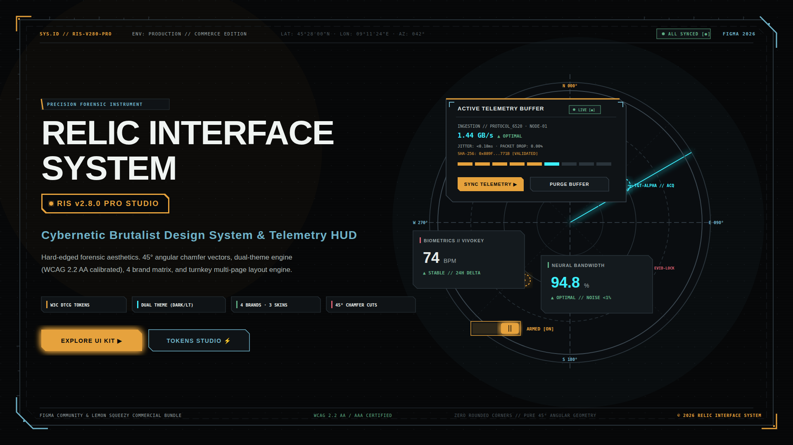
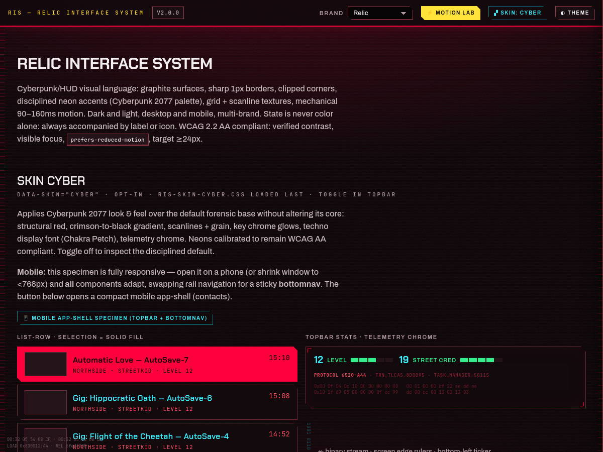
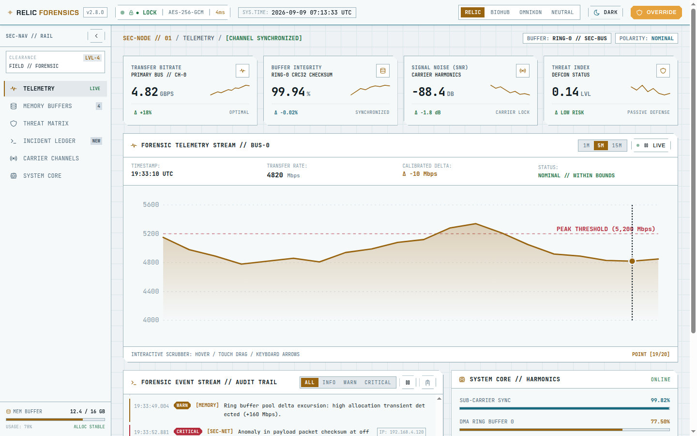
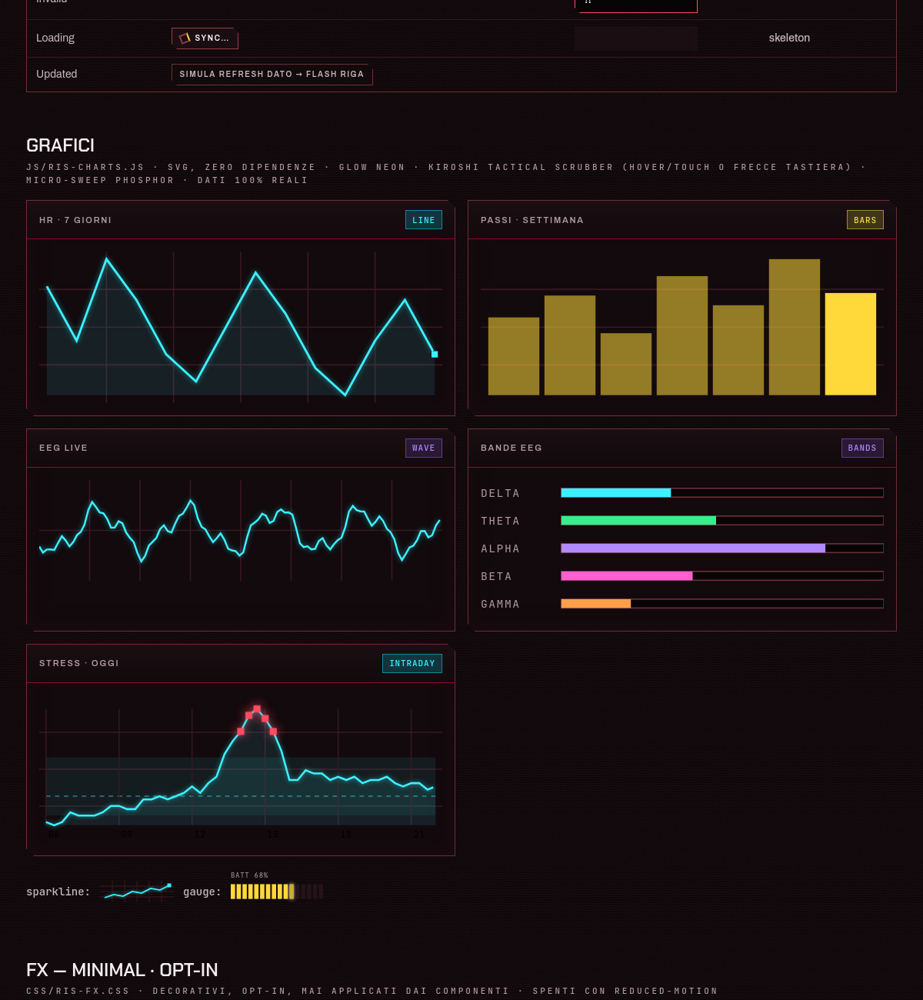
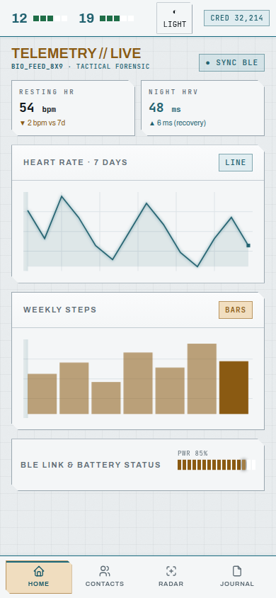

<div align="center">

```
┌─────────────────────────────────────────────────────────────┐
│  [ // RELIC INTERFACE SYSTEM · SYSTEM ARMED · v2.8.0 // ]   │
└─────────────────────────────────────────────────────────────┘
```

# RELIC INTERFACE SYSTEM

### Brutalist tactical HUD & telemetry design system for Web and Jetpack Compose.

[](LICENSE)
[](#ris-core-free-vs-ris-pro-commercial)
[](GUIDELINES.md)
[](compose/)
[](https://yuzushi-dev.github.io/relic-interface-system/motion-lab.html)

<br />

<p align="center">
  <a href="https://yuzushi-dev.github.io/relic-interface-system/"></a>
  &nbsp;
  <a href="https://yuzushi-dev.github.io/relic-interface-system/mobile.html"></a>
  &nbsp;
  <a href="https://yuzushi-dev.github.io/relic-interface-system/motion-lab.html"></a>
  &nbsp;
  <a href="https://buy.polar.sh/polar_cl_UFLik36Vm34gt13RsMxroNhh7VRtez6w4tAR34FlCNv"></a>
</p>

<p align="center">
  <a href="https://yuzushi-dev.github.io/relic-interface-system/"><b>🌐 Launch Desktop Specimen</b></a> &nbsp;•&nbsp;
  <a href="https://yuzushi-dev.github.io/relic-interface-system/mobile.html"><b>📱 Launch Mobile Touch Shell</b></a> &nbsp;•&nbsp;
  <a href="https://yuzushi-dev.github.io/relic-interface-system/motion-lab.html"><b>⚡ Test Motion Physics</b></a> &nbsp;•&nbsp;
  <a href="https://buy.polar.sh/polar_cl_UFLik36Vm34gt13RsMxroNhh7VRtez6w4tAR34FlCNv"><b>⭐ Get Pro Suite ($99)</b></a>
</p>

<p align="center">
  
</p>

| ENGINE | COMPLIANCE | REFLOW JANK | MOTION BUDGET | PALETTE |
| :---: | :---: | :---: | :---: | :---: |
| **CSS + Canvas + Compose** | **WCAG 2.2 AA (≥ 4.5:1)** | **0% (Composited)** | **80ms / 140ms / 200ms** | **Dark HUD · Light Blueprint** |

<br />

[**🌐 Live Specimen (Web)**](https://yuzushi-dev.github.io/relic-interface-system/) &nbsp;·&nbsp; [**📱 Mobile Touch Shell**](https://yuzushi-dev.github.io/relic-interface-system/mobile.html) &nbsp;·&nbsp; [**⚡ Motion & Contrast Lab**](https://yuzushi-dev.github.io/relic-interface-system/motion-lab.html) &nbsp;·&nbsp; [**🤖 Android Compose Port**](compose/README.md) &nbsp;·&nbsp; [**🛒 Polar Store**](https://polar.sh/yuzushi-dev)

</div>

---

## ◈ What is RIS?

Most cyberpunk UI libraries are unusable in production: neon gradients that fail contrast audits, heavy box-shadow glows that drop GPU frames, and mock charts populated with fake random math.

**Relic Interface System (RIS)** was built around production constraints:

- **Disciplined Graphite Surfaces**: 1px crisp borders (`var(--ris-line)`) and native 45° chamfers computed via CSS `clip-path: polygon(...)`. No fuzzy shadows or broken border-radius hacks.
- **Calibrated Motion**: 80ms click snap (`scale(0.97)`), 140ms hover response, zero-reflow CSS Grid drawers (`grid-template-rows: 0fr → 1fr`), and an absolute ban on `ease-in` for entering elements.
- **Zero-Dependency Real Telemetry**: Interactive SVG charts with mouse and keyboard scrubbers (`ArrowLeft` / `ArrowRight`) binding 1:1 to real data streams at 60fps. No Chart.js or D3 runtime overhead.
- **True Dual Theme**: High-contrast tactical HUD in Dark mode; calm architectural blueprint cyan/slate (`#1b6b80`) on light gray in Light mode. Both pass WCAG 2.2 AA contrast (≥ 4.5:1).
- **Native Android Parity**: Complete Jetpack Compose module sharing identical token values, polygon clip shapes, and Canvas chart renderers.

---

## ◈ Interactive Template & Live Showcase

No local setup is required to evaluate or start building. Launch the full environment right in your browser via GitHub Pages:

[](https://yuzushi-dev.github.io/relic-interface-system/)
[](https://yuzushi-dev.github.io/relic-interface-system/mobile.html)
[](https://yuzushi-dev.github.io/relic-interface-system/motion-lab.html)
[](https://polar.sh/yuzushi-dev)

<br />

<p align="center">
  
  &nbsp;
  
</p>
<p align="center">
  
  &nbsp;
  
</p>

### Using as a Project Template

Click **Use this template** on GitHub or clone the repository to spin up a new tactical app:

```bash
git clone https://github.com/yuzushi-dev/relic-interface-system.git my-tactical-app
cd my-tactical-app
python3 -m http.server 8080
```

- **Web (Vanilla CSS)**: Import `css/ris-tokens.css` + `css/ris.css` (and optional `css/ris-skin-cyber.css`). Specimen in [`docs/index.html`](docs/index.html).
- **React + TypeScript**: Native `@relic-ui/react` components with zero-reflow CSS Grid, typed hooks, form primitives, and charts in [`react/`](react/README.md).
- **Figma UI Kit**: Turnkey Master Generator script, Tokens Studio JSON, 60+ components with variants, and vector shapes in [`figma/`](figma/README.md).
- **Tailwind CSS Plugin**: Ready preset with `.chamfer-*` utilities and design tokens in [`tailwind/`](tailwind/README.md).
- **Android / Compose**: Direct drop-in Gradle library module with Maven/JitPack publishing in [`compose/`](compose/README.md).
- **Pro Next.js Template**: Production-ready Forensic Telemetry Dashboard in [`templates/forensic-dashboard/`](templates/forensic-dashboard/README.md).
- **Agent Prompt**: If building with Claude Code, Cursor, or Codex, pass [`DESIGN.md`](DESIGN.md) directly as the system prompt.

---

## ◈ RIS Core (Free) vs RIS Pro (Commercial)

Relic Interface System follows an open-core architecture. The foundational design system and primitives are 100% free and open-source under the [MIT License](LICENSE), while turn-key application templates, the consolidated Figma Studio kit, and enterprise support are governed by the [Commercial Software License](LICENSE_PRO.md).

| Deliverable | Core (Open Source · MIT) | Pro Suite (Commercial License) |
| :--- | :---: | :---: |
| **Design Tokens & CSS** | Full Dark & Light tokens, 4 Brands (`relic`, `biohub`, `omnikon`, `neutral`) | + 3 High-density Case-Context skins (`sealed`, `field`, `archive`) |
| **Figma UI Kit** | Community Preview tokens & generator script | **Figma Studio Kit Pro**: Master generator, 60+ component variants, Auto Layout, Tokens Studio DTCG |
| **React Components** | Buttons, Panels, Switches, Tabs, Modals | Full `@relic-ui/react` library + Form controls, Data Table, Alerts, Sonner Toasts, EEG Canvas |
| **Next.js Templates** | Specimen pages | **Forensic Telemetry Dashboard**: Complete App Router application with Docker container |
| **Android Compose** | Core library module | Production suite with hardware-accelerated Canvas charts & dynamic theming |
| **Commercial Usage** | Unlimited (MIT) | Unlimited commercial products & SaaS without attribution |

### Commercial Pricing Tiers

All Pro licenses are **perpetual (one-time purchase)** with lifetime v2.x updates. Tax and VAT are handled automatically via Merchant of Record ([Polar.sh](https://polar.sh)). Launch early-bird pricing is **pre-applied directly at checkout** — no coupon code required:

| License Tier | Launch Early-Bird Price | Standard List Price | Included Deliverables | Direct Checkout |
| :--- | :---: | :---: | :--- | :---: |
| **Figma Studio Kit** | **$39** | $49 | Turnkey Master script (`code.js`), Tokens Studio DTCG JSON, 60+ component variants, 130+ SVG vectors | [**Buy Figma Kit ($39)**](https://buy.polar.sh/polar_cl_gzshc6MZaGsQy6V3oqQ1U0uK3kIQ7mcGr0wf00JbLZn) |
| **Next.js Forensic Dashboard** | **$49** | $69 | Turn-key Next.js 14 App Router template, interactive telemetry scrubber, Docker container | [**Buy Dashboard ($49)**](https://buy.polar.sh/polar_cl_gil36kSbuzIuyVTz8vJibFbjCeW6z5mB8h31j04C4Qs) |
| **RIS Pro All-Access** *(Best Seller)* | **$99** | $129 | **All templates + Figma Studio + React Pro + Compose + Tailwind + Priority Discussions** | [**Buy All-Access ($99)**](https://buy.polar.sh/polar_cl_UFLik36Vm34gt13RsMxroNhh7VRtez6w4tAR34FlCNv) |
| **Team License** | **$249** | $299 | All-Access for up to 10 developers/designers in an organization + 48h SLA support | [**Contact Team Sales**](mailto:support@yuzushi.party?subject=RIS%20Team%20License) |

> ℹ️ **Support & Guarantee**: 14-day money-back guarantee. Technical support provided via email (`support@yuzushi.party`) and [GitHub Discussions](https://github.com/yuzushi-dev/relic-interface-system/discussions). Perpetual license covers all future v2.x updates.
> Terms and commercial permissions governed by the [RIS Pro Commercial License](LICENSE_PRO.md).

---

## ◈ Component Inventory

Everything you need to ship a forensic dashboard or hardware workbench:

| Category | Primitives | Highlights |
|---|---|---|
| **Buttons & Controls** | `.ris-btn` (Primary, Secondary, Ghost, Danger), `.ris-switch` | 80ms mechanical snap (`scale(0.97)`), AAA invert highlight on hover |
| **Surfaces & Layout** | `.ris-panel`, `.ris-topbar`, `.ris-rail`, `.ris-bottomnav` | Clipped 45° corners, bracket accents (`.ris-bracket`), edge notch rulers |
| **Mobile & Touch** | `.ris-sheet`, `.ris-sheet-handle`, `.ris-listrow` | Touch-first bottom sheets, gesture drag dismiss, 44px touch targets, OLED safe |
| **Disclosures & Overlays** | `.ris-acc`, `.ris-modal-box`, `.ris-toast-stack` | Zero-reflow CSS Grid drawers (`0fr → 1fr`), Sonner-style staggered toasts |
| **Telemetry & Meters** | `.ris-stat`, `.ris-segmeter`, `.ris-progress`, `.ris-radar` | Discrete segmented energy blocks, continuous canvas progress, radar sweep |
| **Interactive Charts** | `RisCharts.line`, `.bars`, `.gauge`, `.intraday`, `.eegWaveform` | Scrubbers with keyboard `Arrow` control, delta badges, peak threshold warnings |
| **Icons** | `icons/ris-icons.svg` | 132 unified technical SVG glyphs (based on Tabler Icons, MIT) |

---

## ◈ Non-Negotiable Engineering Rules

1. **Tokens Only**: Never hardcode hex values in component CSS. Always use `var(--ris-*)`.
2. **Accent = Meaning**: Colors convey state, not decorative clutter (Amber = CTA/active, Cyan = data/scan, Red = alert/blocked, Green = nominal).
3. **No Blind State**: State is never communicated by color alone (WCAG 1.4.1). Always pair with text labels or icons.
4. **Composited Motion**: Animate only `transform` and `opacity`. Never animate `height`, `width`, or `top`.
5. **Strict Real Data**: No randomized mock generators or fake hashes in charts. Every displayed readout maps 1:1 to real metrics.
6. **OLED Safety**: Full-height edge rulers (`.ris-ruler`) are strictly forbidden on viewports `<768px` to prevent optical dead-subpixel illusion.

---

## ◈ Run Local Specimen & Motion Lab

Serve the repository with any HTTP server (e.g. Python):

```bash
python3 -m http.server 8080
```

- **Interactive Desktop Specimen**: `http://localhost:8080/docs/index.html`
- **Mobile Touch Shell**: `http://localhost:8080/docs/mobile.html`
- **Motion & Contrast Lab**: `http://localhost:8080/docs/motion-lab.html`

---

## ◈ Licensing, Attributions & Legal Notice

- **Open-Source Core**: [MIT License](LICENSE) © 2026 Relic Interface System Contributors (governs CSS tokens, utility classes, core `@relic-ui/react` primitives, Tailwind preset, and Android Compose library).
- **Commercial Templates & Studio**: Governed by the [RIS Pro Commercial License](LICENSE_PRO.md) (covers production templates such as `templates/forensic-dashboard/`, advanced canvas telemetry engines, and Figma Studio master generator).
- **Icons**: [Tabler Icons](https://tabler.io/icons) (MIT License, © Paweł Kuna).
- **Typography**: Archivo, JetBrains Mono, Chakra Petch, and Rajdhani under the SIL Open Font License.
- **Legal Notice**: Relic Interface System is an independent, original design system and component architecture. All styling, SVG geometry, color token architectures, Canvas renderers, and motion timings are entirely bespoke and unencumbered.
